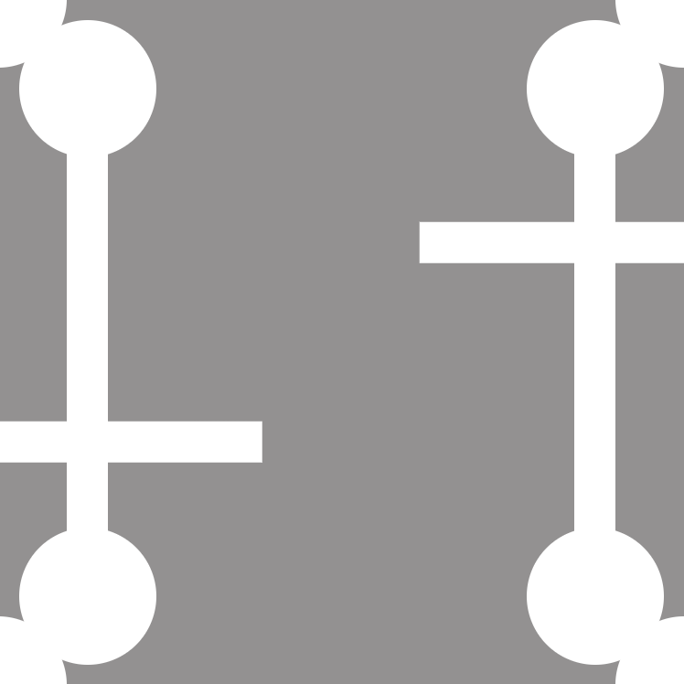
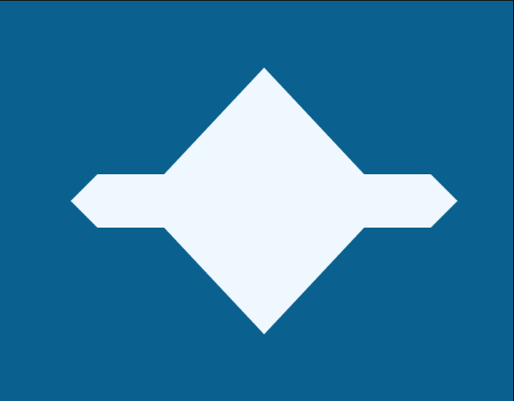
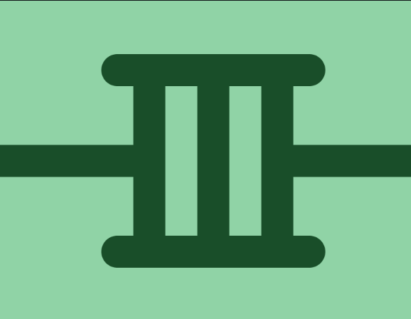

# CSS design practice

- Practice 1  
    
- Practice 2  
    
- Practice 3  
    
- Practice 4  
    
- Practice 5  
    
- Practice 6  
    
- Practice 7  
    
- Practice 8  
    
- Practice 9  
    
- Practice 10  
    
- Practice 11  
    
